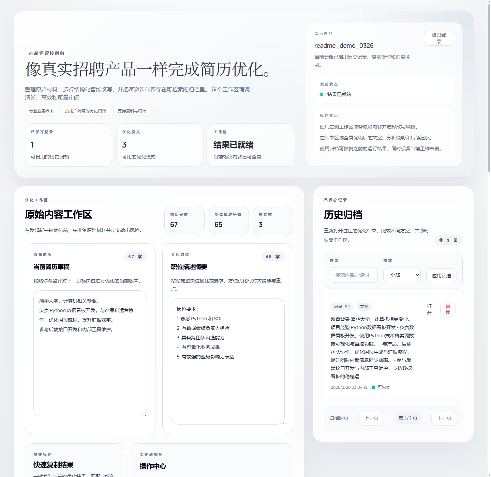
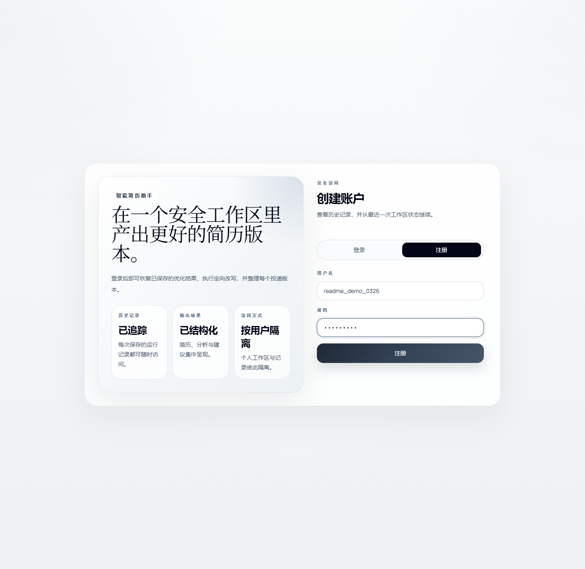
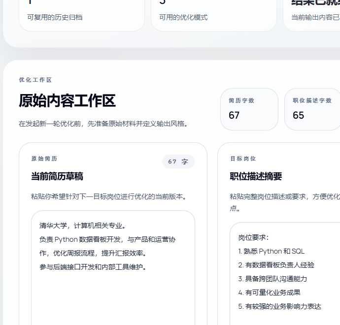
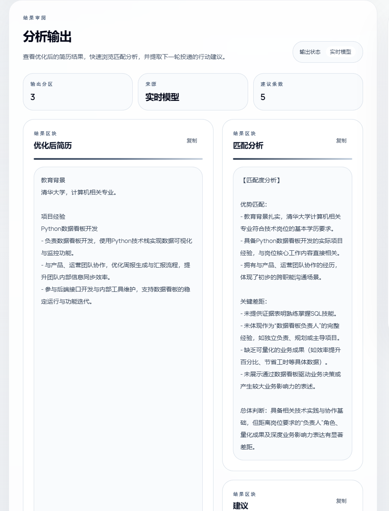
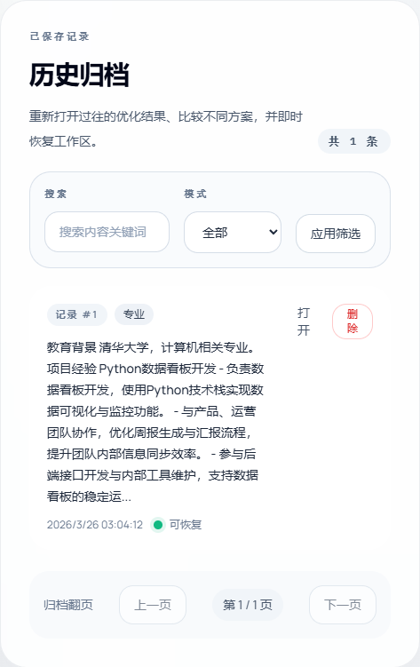

# AI Resume Assistant 中文版

AI Resume Assistant 是一个面向求职场景的小型全栈项目，用来把当前简历草稿针对目标岗位描述做定向优化。项目包含 React 18 + Vite 前端、FastAPI + SQLite 后端、JWT 登录鉴权，以及一个支持 OpenAI 兼容接口的 AI 优化层。

这版仓库已经不只是“调用一次模型然后返回结果”，而是围绕简历优化做了更完整的一套闭环：

- 中文工作台：登录后可直接编辑原始简历、岗位描述和优化模式
- 两阶段 AI 优化：先抽取事实，再基于事实做 grounded rewrite，尽量减少幻觉
- 结构化输出：返回优化后简历、匹配分析、修改建议
- 个人历史归档：每位用户都能查看、搜索、恢复和删除自己的优化记录
- 固定样例评测：提供 3 组固定 case 和脚本，用来比较 Prompt 或流程迭代前后的真实输出质量

当前界面文案为中文，下面的截图使用了一个演示账号和中文测试内容重新走完整流程。截图中的示例账号为 `readme_demo_0326`，密码为 `abc123456`。

## 页面截图

### 总览



登录后的完整工作台总览。左侧是原始材料输入和结果区块，右侧是按用户隔离的历史归档。

### 细节视图

| 登录 / 注册 | 原始内容工作区 |
| --- | --- |
|  |  |
| 中文登录注册面板，演示账号使用 `readme_demo_0326 / abc123456`。 | 使用中文测试简历和中文岗位描述，模式切换与触发按钮均使用当前版本界面。 |

| 结果区块 | 历史归档 |
| --- | --- |
|  |  |
| 展示优化后简历、匹配分析、建议三个结果区块，并支持逐块复制。 | 展示当前用户的历史记录、筛选控件、分页、恢复和删除操作。 |

## 当前版本能做什么

- 注册、登录和退出登录
- 录入 `resume_text`、`jd_text` 和优化模式
- 支持 3 种模式：`Professional`、`Concise`、`Achievement-Oriented`
- 返回 3 个结构化结果字段：
  - `optimized_resume`
  - `match_analysis`
  - `suggestions`
- 支持复制整组结果，也支持分别复制优化后简历、匹配分析和建议
- 使用 SQLite 持久化历史记录，并按用户隔离
- 支持历史记录搜索、样式过滤、分页、恢复和删除
- 支持 OpenAI 兼容接口；未配置 API Key 时自动走本地 mock
- 支持固定样例评测脚本，用于做 Prompt/流程回归比较

## 项目亮点

### 1. 两阶段 AI 优化流程

后端不再只靠单轮 Prompt 直接生成结果，而是分成两步：

1. 从原始简历中抽取 grounded facts
2. 只基于这些事实和 JD 差距，生成优化后简历、匹配分析和建议

这样做的目标是：

- 减少“为了贴 JD 而编造不存在的技能或经历”
- 尽量保留学校、项目、技术栈、量化结果等关键事实
- 让 `match_analysis` 更像“证据 + 缺口”分析，而不是模板化夸赞

### 2. 固定样例评测

除了常规单元测试，仓库里还补了一套固定样例评测：

- `cn_gap_sql`
- `cn_quantified_dashboard`
- `en_backend_general`

它们会从 5 个维度给输出打分：

- `language_ok`
- `must_keep_ok`
- `must_not_claim_ok`
- `gap_flagged_ok`
- `actionable_suggestions_ok`

这套脚本的价值是：每次改 Prompt 或两阶段流程之后，都可以用同一批样例反复跑，判断输出是整体变稳了，还是只是在某一个例子上偶然变好。

## 技术栈

- 前端：React 18、Vite 5、Tailwind CSS
- 后端：FastAPI、SQLAlchemy 2、SQLite、Pydantic Settings
- 鉴权：JWT（`python-jose`）+ `passlib`
- AI：OpenAI Python SDK（兼容 OpenAI 风格 API）
- 前端测试：Vitest + Testing Library
- 后端测试：`unittest`

## 产品流程

1. 注册或登录
2. 输入当前简历草稿
3. 输入目标岗位描述
4. 选择优化模式
5. 发起 AI 优化请求
6. 查看优化后简历、匹配分析和建议
7. 复制结果或从历史归档中恢复之前的版本

## 目录结构

```text
.
+-- frontend/
|   +-- src/
|   |   +-- components/
|   |   +-- hooks/
|   |   +-- utils/
|   |   +-- App.jsx
|   |   +-- api.js
|   |   \-- main.jsx
|   \-- package.json
+-- backend/
|   +-- app/
|   |   +-- api/
|   |   +-- services/
|   |   |   +-- ai_service.py
|   |   |   \-- eval_service.py
|   |   +-- config.py
|   |   +-- crud.py
|   |   +-- main.py
|   |   +-- models.py
|   |   \-- schemas.py
|   +-- evals/
|   |   +-- cases/
|   |   \-- results/
|   +-- scripts/
|   |   \-- run_eval_samples.py
|   +-- tests/
|   \-- requirements.txt
\-- docs/
    +-- PAIRING_NOTES.md
    \-- images/
```

## 关键文件

- `frontend/src/App.jsx`：顶层工作台、登录态切换、结果区和历史区布局
- `frontend/src/components/ResumeForm.jsx`：原始简历、岗位描述、模式选择和触发按钮
- `frontend/src/components/OptimizationResult.jsx`：优化后简历、匹配分析、建议三块结果面板
- `frontend/src/components/HistoryList.jsx`：历史记录展示、打开、删除、分页
- `frontend/src/api.js`：前端 API 请求封装
- `backend/app/api/auth_routes.py`：注册、登录、当前用户接口
- `backend/app/api/routes.py`：优化、列表、详情、删除接口
- `backend/app/services/ai_service.py`：两阶段 AI 流程、AI 请求、mock/fallback 逻辑
- `backend/app/services/eval_service.py`：固定样例评测打分逻辑
- `backend/scripts/run_eval_samples.py`：批量运行评测 case 并输出 JSON 报告
- `backend/tests/test_history_api.py`：当前后端主要测试模块

## 本地运行

### 1. 启动后端

在 `backend/` 目录下：

```powershell
python -m venv .venv
.venv\Scripts\activate
pip install -r requirements.txt
copy .env.example .env
```

至少要给 `backend/.env` 配置一个 JWT 密钥：

```env
JWT_SECRET_KEY=change_me_to_a_real_local_secret
```

然后启动后端：

```powershell
uvicorn app.main:app --reload
```

### 2. 启动前端

在 `frontend/` 目录下：

```powershell
npm install
copy .env.example .env.local
```

如果需要，设置 API 地址：

```env
VITE_API_BASE_URL=http://127.0.0.1:8000
```

然后启动前端：

```powershell
npm run dev
```

### 3. 默认地址

- 前端：`http://127.0.0.1:5173`
- 后端：`http://127.0.0.1:8000`
- FastAPI 文档：`http://127.0.0.1:8000/docs`

## 环境变量

### 后端（`backend/.env`）

| 变量名 | 是否必填 | 说明 |
| --- | --- | --- |
| `OPENAI_API_KEY` | 否 | 留空时走本地 mock 输出 |
| `OPENAI_BASE_URL` | 否 | OpenAI 兼容接口地址 |
| `OPENAI_MODEL` | 否 | 调用的模型名 |
| `DATABASE_URL` | 否 | 默认使用 SQLite |
| `JWT_SECRET_KEY` | 是 | 为空时后端无法正常启动 |
| `JWT_ALGORITHM` | 否 | 默认 `HS256` |
| `JWT_ACCESS_TOKEN_EXPIRE_MINUTES` | 否 | Token 有效期 |
| `CORS_ALLOWED_ORIGINS` | 否 | 前端允许来源，逗号分隔 |

### 前端（`frontend/.env.local` 等）

| 变量名 | 是否必填 | 说明 |
| --- | --- | --- |
| `VITE_API_BASE_URL` | 是 | 后端 FastAPI 基础地址 |

## AI 返回来源说明

调用 `/api/optimize` 后，响应里可能出现：

- `result_source=ai`：成功使用了真实模型返回
- `result_source=mock`：未配置 API Key，直接使用本地 mock 输出
- `result_source=fallback`：尝试调用真实模型失败后，退回到本地兜底输出

同时还可能附带 `fallback_reason`，例如：

- `missing_api_key`
- `request_exception`
- `invalid_json_response`
- `empty_ai_response`
- `incomplete_ai_payload`

如果提供商认证信息错误，后端会返回明确的认证/配置错误，而不是静默退回 mock。

## 接口概览

### 鉴权

- `POST /api/auth/register`
- `POST /api/auth/login`
- `GET /api/auth/me`

### 简历优化与历史记录

- `POST /api/optimize`
- `GET /api/records?page=1&page_size=5&keyword=&style=`
- `GET /api/records/{id}`
- `DELETE /api/records/{id}`

## 测试与验证

### 前端

运行全部前端测试：

```powershell
cd frontend
npm run test
```

运行单个前端测试文件：

```powershell
cd frontend
npm run test:one -- src/components/ResumeForm.test.jsx
```

构建前端：

```powershell
cd frontend
npm run build
```

### 后端

运行当前后端测试模块：

```powershell
cd backend
.venv\Scripts\python.exe -m unittest tests.test_history_api
```

### 固定样例评测

运行全部固定样例：

```powershell
cd backend
.venv\Scripts\python.exe scripts\run_eval_samples.py
```

只运行一组样例：

```powershell
cd backend
.venv\Scripts\python.exe scripts\run_eval_samples.py --case cn_gap_sql
```

评测脚本会读取 `backend/evals/cases/` 中的 JSON case，并把报告写到 `backend/evals/results/`。

## 说明

- 前端目前使用的是 JavaScript，不是 TypeScript
- 这是一个单页工作台应用，不是多路由网站
- 默认数据库是仓库内的 SQLite
- 当前输出路径以复制到剪贴板和历史记录复用为主，没有导出文件功能
- `docs/PAIRING_NOTES.md` 里保存了这轮开发和学习过程中的关键结论与复盘记录
